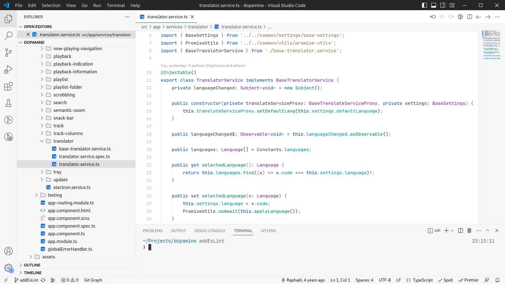
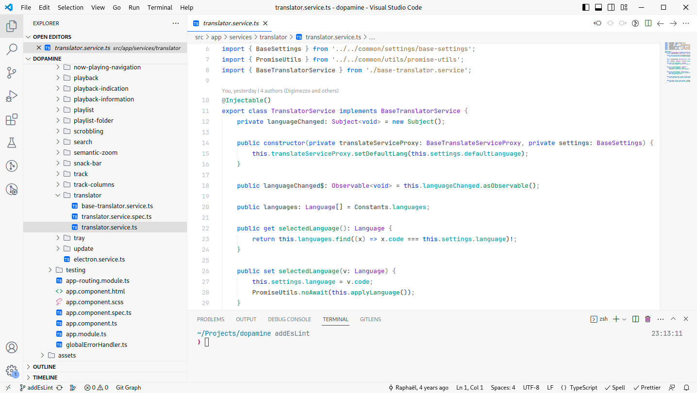
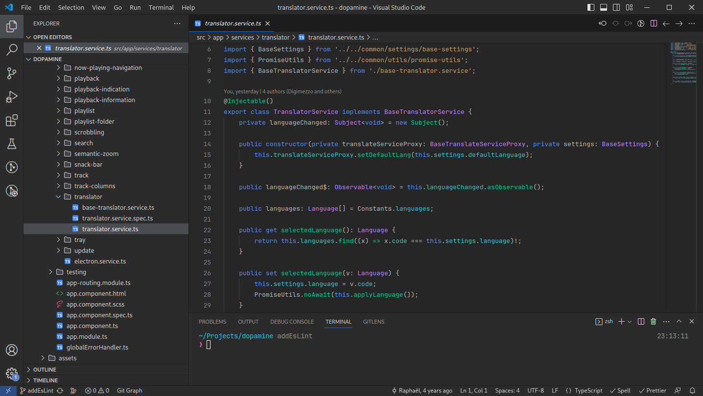

# JetBrains Rider New UI

JetBrains Rider New UI theme for Visual Studio Code. There are 3 color variants:

- Light
- Lighter
- Dark

## Light



## Lighter



## Dark



## Installing

This extension is available for free in the Visual Studio Code [Marketplace](https://marketplace.visualstudio.com/items?itemName=digimezzo.jetbrains-rider-new-ui-theme)

## Recommended Visual Studio Code settings

```
"editor.fontSize": 13,
"editor.lineHeight": 22,
"editor.fontFamily": "JetBrains Mono",
"editor.bracketPairColorization.enabled": false,
"editor.rulers": [120],
```

## Recommended icon theme

JetBrains Icon Theme, available in the the Visual Studio Code [Marketplace](https://marketplace.visualstudio.com/items?itemName=chadalen.vscode-jetbrains-icon-theme)
